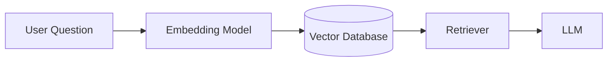
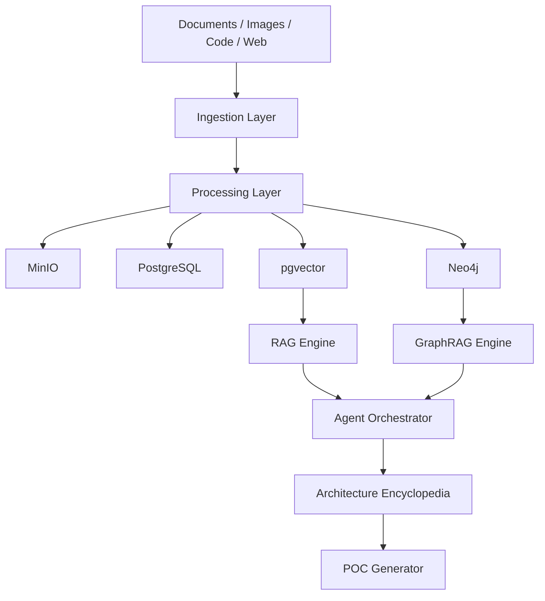

La idea puede estructurarse como una **“Open Architecture Knowledge Fabric”**: un laboratorio local y open source que combine Data Engineering, RAG, Knowledge Graphs y Agentic AI, y que además convierta automáticamente diagramas/imágenes técnicas en documentación reutilizable.

El objetivo del prompt es que Codex no intente construir todo de una vez, sino que cree primero la arquitectura, el repositorio, las convenciones y luego avance **componente por componente, con pruebas y documentación**.

# Build an Open Architecture Knowledge Fabric

You are acting as a **Senior AI Software Engineer, Data Engineer, AI Architect, and Technical Documentation Engineer**.

Build an open-source, Docker-first platform that combines:

* Data engineering
* Lakehouse concepts
* RAG
* Vector search
* Knowledge Graphs
* Agentic AI
* Architecture-document ingestion
* Image/diagram understanding
* Automatic Markdown documentation
* Mermaid architecture diagrams
* Reusable Proof-of-Concept templates

The long-term goal is to create a **personal Architecture Encyclopedia and AI Knowledge Base** where architecture images, diagrams, notes, code examples, and generated documentation become searchable and usable by AI agents for designing future systems and POCs.

---

# 1. Primary Goal

Create a local/open-source equivalent of the important architectural concepts behind platforms such as Microsoft Fabric, but focused on learning, experimentation, AI engineering, and architecture knowledge management.

The system should eventually support this flow:

```text
Architecture Images
PDFs
Markdown
HTML
Source Code
Technical Notes
Vendor Documentation
        │
        ▼
Ingestion Pipeline
        │
        ▼
Content Extraction
        │
        ├── Text
        ├── Metadata
        ├── Image Description
        ├── Architecture Components
        └── Relationships
        │
        ▼
Knowledge Processing
        │
        ├── Chunking
        ├── Embeddings
        ├── Entity Extraction
        ├── Relationship Extraction
        └── Architecture Classification
        │
        ▼
┌───────────────────────────────────────┐
│         Knowledge Storage             │
│                                       │
│ Vector DB       Knowledge Graph       │
│ PostgreSQL      Object Storage        │
│ Metadata DB     Lakehouse             │
└───────────────────┬───────────────────┘
                    │
                    ▼
              Agentic RAG
                    │
     ┌──────────────┼──────────────┐
     ▼              ▼              ▼
 Search Agent  Architecture   Documentation
               Agent          Agent
                    │
                    ▼
        Architecture Encyclopedia
                    │
        ├── Markdown
        ├── Mermaid
        ├── HTML
        ├── Images
        ├── Code
        ├── References
        └── POC templates
```

---

# 2. Docker-First Architecture

Everything possible should initially run locally using **Docker Compose**.

Design components so they can later migrate to Kubernetes.

Use containers with persistent volumes and environment-based configuration.

Initial platform components:

| Capability             | Preferred Technology                       |
| ---------------------- | ------------------------------------------ |
| Object Storage         | MinIO                                      |
| Lakehouse Tables       | Apache Iceberg                             |
| Lightweight Analytics  | DuckDB                                     |
| Distributed Processing | Apache Spark / PySpark                     |
| Relational Database    | PostgreSQL                                 |
| Vector Search          | pgvector                                   |
| Knowledge Graph        | Neo4j                                      |
| Data Ingestion         | Airbyte                                    |
| Workflow Orchestration | Apache Airflow                             |
| Event Streaming        | Apache Kafka                               |
| ML Experiment Tracking | MLflow                                     |
| Notebook Environment   | JupyterLab                                 |
| Dashboards             | Apache Superset                            |
| API                    | FastAPI                                    |
| AI Framework           | Python                                     |
| Local LLM support      | Ollama / OpenAI-compatible API             |
| RAG orchestration      | Prefer simple Python abstractions first    |
| Agent orchestration    | Lightweight custom Python agents initially |
| Observability          | OpenTelemetry                              |
| Metrics                | Prometheus                                 |
| Dashboards             | Grafana                                    |

Do not introduce every component immediately.

Implement progressively.

---

# 3. Repository Structure

Create or adapt the repository toward this structure:

```text
architecture-knowledge-fabric/
│
├── README.md
├── docker-compose.yml
├── .env.example
├── Makefile
│
├── images/
│   ├── incoming/
│   ├── processed/
│   └── generated/
│
├── documents/
│   ├── incoming/
│   ├── processed/
│   └── generated/
│
├── knowledge/
│   ├── architectures/
│   ├── technologies/
│   ├── concepts/
│   ├── patterns/
│   ├── comparisons/
│   └── poc/
│
├── diagrams/
│   ├── mermaid/
│   ├── html/
│   └── generated/
│
├── ingestion/
│   ├── images/
│   ├── documents/
│   ├── web/
│   └── code/
│
├── src/
│   ├── extraction/
│   ├── chunking/
│   ├── embeddings/
│   ├── retrieval/
│   ├── graph/
│   ├── rag/
│   ├── agents/
│   ├── api/
│   └── common/
│
├── agents/
│   ├── image_analyzer/
│   ├── architecture_analyzer/
│   ├── knowledge_graph_agent/
│   ├── documentation_agent/
│   ├── research_agent/
│   ├── rag_agent/
│   ├── validation_agent/
│   └── poc_agent/
│
├── graph/
│   ├── schemas/
│   ├── cypher/
│   └── exports/
│
├── lakehouse/
│   ├── bronze/
│   ├── silver/
│   └── gold/
│
├── notebooks/
│
├── tests/
│   ├── unit/
│   ├── integration/
│   └── evaluation/
│
├── observability/
│
├── infrastructure/
│   ├── docker/
│   ├── kubernetes/
│   ├── helm/
│   └── bicep/
│
└── docs/
    ├── architecture/
    ├── decisions/
    ├── tutorials/
    └── learning/
```

Do not create unnecessary empty complexity.

Only create directories when their implementation begins.

---

# 4. Image-to-Architecture Pipeline

One of the most important features is the `images/` folder.

The system must be able to inspect architecture diagrams stored there.

For every new architecture image:

```text
images/incoming/<image>
        ↓
Image Analyzer Agent
        ↓
Identify:
- title
- technology
- architecture style
- components
- connections
- arrows/data flow
- boundaries
- cloud services
- databases
- APIs
- queues
- agents
- LLMs
- vector databases
- security components
- observability
        ↓
Architecture Analyzer
        ↓
Generate normalized architecture model
        ↓
Documentation Agent
        ↓
Markdown + Mermaid + references
        ↓
Knowledge Graph + Vector Index
```

Preserve the source image.

Never discard it after processing.

---

# 5. Architecture Image Output

For every architecture image, create something similar to:

```text
knowledge/architectures/<architecture-name>/
│
├── README.md
├── architecture.md
├── implementation.md
├── components.md
├── data-flow.md
├── security.md
├── alternatives.md
├── poc.md
├── metadata.yaml
│
├── diagrams/
│   ├── architecture.mmd
│   ├── architecture.md
│   └── architecture.html
│
└── references/
    └── source-images.md
```

The documentation must reference the original image using a relative Markdown reference whenever possible:

```markdown
## Original Architecture


```

---

# 6. Generated Architecture Documentation

Each `architecture.md` should contain:

## Purpose

Explain what the architecture solves.

## Architecture Overview

Describe the architecture in beginner-friendly language.

## Original Diagram

Reference the original source image.

## Components

Use a table:

| Component | Purpose | Input | Output | Technology |
| --------- | ------- | ----- | ------ | ---------- |

## Data Flow

Explain the sequence step-by-step.

Example:

```text
User Question
    ↓
Embedding
    ↓
Vector Search
    ↓
Relevant Chunks
    ↓
Prompt Construction
    ↓
LLM
    ↓
Answer
```

Under each arrow explain the actual data being transferred.

## Mermaid Diagram

Create an equivalent Mermaid diagram.

Example:



## Implementation Notes

Explain how someone could reproduce the architecture.

## POC

Provide a minimal proof-of-concept implementation plan.

## Alternatives

Explain possible substitutes.

Example:

```text
Neo4j → ArangoDB / Memgraph
pgvector → Qdrant / Weaviate
MinIO → S3 / Azure Blob
Kafka → Redpanda
Airflow → Dagster
```

## Failure Modes

Explain what can fail.

## Security

Identify authentication, authorization, secrets, network boundaries and sensitive-data considerations.

## Observability

Identify relevant:

* logs
* traces
* metrics
* alerts

---

# 7. Knowledge Graph

Create a technology knowledge graph.

Use Neo4j initially.

Example nodes:

```text
Technology
Architecture
Pattern
Component
Database
Protocol
CloudService
AIModel
Agent
Library
Concept
Document
Image
POC
```

Example relationships:

```text
Architecture USES Technology

Technology IMPLEMENTS Pattern

Agent USES AIModel

RAG USES VectorDatabase

RAG USES EmbeddingModel

GraphRAG USES KnowledgeGraph

Document DESCRIBES Architecture

Image REPRESENTS Architecture

Architecture HAS_COMPONENT Component

Component SENDS_DATA_TO Component

Technology ALTERNATIVE_TO Technology

Technology DEPENDS_ON Technology

POC IMPLEMENTS Architecture
```

Example:

```text
[RAG]
   │ USES
   ▼
[Embeddings]
   │ STORED_IN
   ▼
[pgvector]

[RAG]
   │ AUGMENTED_BY
   ▼
[Knowledge Graph]
   │ IMPLEMENTED_WITH
   ▼
[Neo4j]
```

---

# 8. RAG Architecture

Implement traditional RAG first.

```text
Documents
   ↓
Extraction
   ↓
Cleaning
   ↓
Chunking
   ↓
Embeddings
   ↓
pgvector
```

Query:

```text
Question
   ↓
Embedding
   ↓
Vector Search
   ↓
Top-K chunks
   ↓
Context Builder
   ↓
LLM
   ↓
Cited Answer
```

Every response should preserve provenance.

Minimum chunk metadata:

```json
{
  "chunk_id": "...",
  "document_id": "...",
  "source": "...",
  "source_type": "...",
  "title": "...",
  "section": "...",
  "page": null,
  "image_reference": null,
  "created_at": "...",
  "technology": [],
  "architecture": [],
  "tags": []
}
```

---

# 9. GraphRAG

After basic RAG works, implement GraphRAG concepts.

Pipeline:

```text
Document / Image
       ↓
Entity Extraction
       ↓
Relationship Extraction
       ↓
Neo4j
       │
       ├─────────────┐
       ▼             ▼
Vector Retrieval   Graph Traversal
       │             │
       └──────┬──────┘
              ▼
       Context Fusion
              ▼
             LLM
```

Graph retrieval should answer questions such as:

```text
What architectures use Kafka?

How is Neo4j related to GraphRAG?

Show architectures combining:
RAG + Agents + Knowledge Graph.

What could replace pgvector in this design?

Which POCs use MinIO?

Show the path:
Document → Embedding → Vector DB → Retriever → LLM.
```

---

# 10. Agentic AI Layer

Create specialized agents instead of one giant agent.

Initial design:

```text
                    Orchestrator Agent
                           │
         ┌─────────────────┼──────────────────┐
         ▼                 ▼                  ▼
   Research Agent    Knowledge Agent   Architecture Agent
         │                 │                  │
         ▼                 ▼                  ▼
 Web/Documents       RAG + Graph        Design Analysis
                           │
                           ▼
                    Documentation Agent
                           │
                           ▼
                    Validation Agent
                           │
                           ▼
                        Output
```

Agents:

### Image Analyzer Agent

Analyzes technical diagrams.

Responsibilities:

* identify components
* identify relationships
* reconstruct data flow
* detect labels
* identify technology names
* determine architectural pattern

### Architecture Agent

Transforms extracted information into a formal architecture description.

### Knowledge Agent

Queries:

* vector database
* Neo4j
* metadata database

### RAG Agent

Retrieves supporting source material.

### Research Agent

Researches missing concepts when external information is explicitly requested.

Never allow researched information to silently replace source information.

Track provenance.

### Documentation Agent

Creates standardized encyclopedia entries.

### Validation Agent

Verifies:

* Mermaid syntax
* links
* references
* unsupported claims
* duplicated content
* missing components
* diagram consistency

### POC Agent

Converts an architecture into an executable implementation plan.

---

# 11. Agent Autonomy

Do not initially create fully autonomous agents.

Use controlled workflows.

Preferred model:

```text
Observe
   ↓
Retrieve
   ↓
Reason
   ↓
Plan
   ↓
Execute Tool
   ↓
Validate
   ↓
Record Result
```

Require clear tool boundaries.

Agents should not execute destructive actions automatically.

All generated files must be reviewable.

---

# 12. Architecture Encyclopedia

The final system should behave like a personal technical encyclopedia.

Example:

```text
knowledge/

AI/
├── rag/
├── graphrag/
├── embeddings/
├── vector-search/
└── agents/

Data/
├── lakehouse/
├── iceberg/
├── spark/
├── kafka/
└── airflow/

Architecture/
├── event-driven/
├── microservices/
├── agentic-ai/
├── enterprise-rag/
└── data-platform/

Cloud/
├── azure/
├── aws/
└── open-source/
```

---

# 13. Cross Linking

Markdown files should reference related concepts.

Example:

```markdown
## Related Topics

- [[RAG]]
- [[GraphRAG]]
- [[Embeddings]]
- [[Neo4j]]
- [[Vector Search]]
- [[Agentic AI]]
```

Also maintain ordinary Markdown relative links so documentation does not depend exclusively on Obsidian.

---

# 14. Architecture Metadata

Each architecture should have metadata similar to:

```yaml
name: Enterprise Agentic RAG

category:
  - AI
  - RAG
  - Agentic AI

technologies:
  - Python
  - FastAPI
  - pgvector
  - Neo4j

patterns:
  - Retrieval Augmented Generation
  - Knowledge Graph
  - Agent Orchestration

sources:
  images:
    - images/processed/agentic-rag.png

generated:
  mermaid:
    - diagrams/architecture.mmd

poc_available: true
```

---

# 15. Lakehouse Design

Use a Bronze / Silver / Gold model.

```text
BRONZE
Raw documents
Raw images
Raw extracted metadata
Raw events
        ↓
SILVER
Clean text
Normalized metadata
Chunks
Entities
Relationships
        ↓
GOLD
Architecture documents
Knowledge graph
Embeddings
Technology profiles
POC templates
Analytics
```

Use MinIO as object storage.

Introduce Apache Iceberg only once the simpler storage pipeline works correctly.

---

# 16. Event-Driven Processing

Later introduce Kafka.

Example:

```text
New Image
   ↓
image.uploaded
   ↓
Image Analyzer
   ↓
image.analyzed
   ↓
Architecture Agent
   ↓
architecture.generated
   ↓
Knowledge Graph Agent
   ↓
knowledge.updated
   ↓
Embedding Pipeline
   ↓
vector.updated
```

Do NOT start with Kafka.

First make the workflow work synchronously.

Then introduce events.

---

# 17. API Layer

Use FastAPI.

Example endpoints:

```text
POST /ingest/document

POST /ingest/image

GET /architectures

GET /architectures/{id}

POST /rag/query

POST /graph/query

POST /agent/query

POST /poc/generate

GET /technologies

GET /health
```

---

# 18. Observability

Instrument major components using OpenTelemetry.

Track at minimum:

```text
request_id
trace_id
agent
tool
operation
duration
tokens
retrieval_count
retrieval_score
graph_nodes
graph_relationships
errors
```

Eventually export to:

```text
OpenTelemetry
      ↓
Prometheus
      ↓
Grafana
```

---

# 19. Evaluation

Do not evaluate RAG based only on fluent answers.

Create evaluation cases covering:

```text
Retrieval correctness
Citation correctness
Context relevance
Answer faithfulness
Graph traversal accuracy
Entity extraction accuracy
Architecture reconstruction accuracy
```

Create test questions with expected sources.

---

# 20. Proof-of-Concept Generator

One important final feature:

```text
Architecture Entry
        ↓
POC Agent
        ↓
Generate
├── README
├── Docker Compose
├── Python services
├── sample dataset
├── architecture diagram
├── configuration
├── API tests
└── tutorial
```

A user should eventually be able to ask:

```text
Build a POC based on the Enterprise GraphRAG architecture.
```

The agent should use the architecture encyclopedia as the source of truth.

---

# 21. Generated HTML

For important architectures also produce standalone HTML visualization.

Example:

```text
architecture.md
architecture.mmd
architecture.html
```

HTML should provide:

* architecture title
* diagram
* components
* data flow
* implementation notes
* source references
* related architectures

Keep HTML generation separate from the canonical Markdown source.

Markdown remains the primary source of truth.

---

# 22. Human Review

Do not silently modify architecture knowledge.

Use this lifecycle:

```text
incoming
   ↓
processed
   ↓
generated
   ↓
review
   ↓
approved
   ↓
knowledge-base
```

Allow manually correcting an architecture before making it canonical.

---

# 23. Implementation Strategy

DO NOT build everything immediately.

Work in phases.

## Phase 1 — Foundation

Create:

* repository structure
* architecture document
* ADRs
* Docker Compose
* PostgreSQL
* pgvector
* MinIO
* Neo4j
* FastAPI

Verify all containers.

## Phase 2 — Document RAG

Build:

```text
Markdown/PDF
→ extraction
→ chunking
→ embeddings
→ pgvector
→ retrieval
→ LLM
```

## Phase 3 — Image Architecture Analyzer

Build:

```text
images/
→ analyze architecture diagram
→ structured architecture representation
→ Markdown
→ Mermaid
```

## Phase 4 — Knowledge Graph

Extract:

```text
Technology
Component
Architecture
Relationship
```

Store in Neo4j.

## Phase 5 — GraphRAG

Combine vector retrieval and graph traversal.

## Phase 6 — Agentic AI

Introduce specialized agents and orchestration.

## Phase 7 — Architecture Encyclopedia

Create cross-linked Markdown knowledge base.

## Phase 8 — POC Generator

Generate implementation projects from architecture definitions.

## Phase 9 — Data Platform

Introduce:

* Airflow
* DuckDB
* Iceberg
* Spark
* Kafka

only when justified.

## Phase 10 — Observability

Add:

* OpenTelemetry
* Prometheus
* Grafana

## Phase 11 — Kubernetes

Convert stable Docker services to:

* Kubernetes manifests
* Helm charts

Optional Azure deployment can later use:

* Bicep
* AKS
* Azure Storage
* Azure OpenAI
* Azure AI Search

but the core platform must remain cloud-independent.

---

# 24. Development Rules

Follow these rules throughout the project.

1. Keep Python code simple and readable.
2. Use type hints.
3. Add tests before considering a feature complete.
4. Prefer small modules.
5. Avoid unnecessary frameworks.
6. Explain every architectural decision.
7. Never hide complexity behind unexplained abstractions.
8. Avoid premature distributed architecture.
9. Start local.
10. Dockerize stable components.
11. Validate before moving to the next phase.
12. Preserve provenance of all knowledge.
13. Never fabricate architecture details missing from a source image.
14. Clearly mark inferred information.
15. Clearly separate:

* extracted information
* inferred information
* researched information
* generated recommendations

---

# 25. Learning Mode

This project is also a learning environment.

Do not simply implement everything for me.

For each major component:

1. Explain the concept.
2. Explain why it exists.
3. Explain how it fits into the complete architecture.
4. Give me one manageable implementation assignment.
5. Let me implement or inspect it.
6. Review the result.
7. Explain mistakes or gaps.
8. Record progress.
9. Continue to the next task.

Use a file such as:

```text
docs/learning/progress.md
```

Track:

```text
Topic
Status
What I implemented
What I understand
Questions
Mistakes
Concepts to revisit
Next assignment
```

---

# 26. Architecture Decision Records

Maintain ADRs for important decisions.

Example:

```text
docs/decisions/

ADR-001-postgresql-pgvector.md
ADR-002-neo4j-knowledge-graph.md
ADR-003-minio-object-storage.md
ADR-004-docker-first.md
ADR-005-mermaid-documentation.md
```

Each ADR:

```text
Context
Decision
Alternatives
Tradeoffs
Consequences
```

---

# 27. Initial Architecture

Begin conceptually with:



---

# 28. First Execution

Before writing significant code:

### Step 1

Inspect the existing repository.

Report:

```text
Existing structure
Existing code
Existing Docker configuration
Existing documentation
Reusable components
Problems
Missing components
```

Do not overwrite useful work.

### Step 2

Inspect the `images/` folder.

For every relevant architecture image identify:

```text
filename
probable architecture
technologies
major components
relationships
possible documentation topic
```

Create:

```text
docs/image-inventory.md
```

### Step 3

Create:

```text
docs/architecture/vision.md
```

Document the complete target architecture.

### Step 4

Create:

```text
docs/architecture/component-map.md
```

Map:

```text
Component
Responsibility
Technology
Dependencies
Phase
Status
```

### Step 5

Create:

```text
docs/ROADMAP.md
```

Break implementation into small independently verifiable milestones.

### Step 6

Create or update:

```text
docs/learning/progress.md
```

### Step 7

STOP.

Present:

* repository assessment
* image inventory
* architecture
* Mermaid diagram
* roadmap
* first implementation assignment

Do not begin Phase 1 implementation until the architecture and first assignment are clear.

---

# 29. First Practical Milestone

The first working vertical slice should intentionally be small:

```text
Architecture Image
       ↓
Image Analysis
       ↓
Structured JSON
       ↓
Markdown
       ↓
Mermaid
       ↓
PostgreSQL metadata
       ↓
pgvector embedding
       ↓
Semantic Search
       ↓
Question
       ↓
Cited Answer
```

Only after this works should Neo4j and GraphRAG be introduced.

---

# 30. Definition of Success

Eventually I should be able to place an image such as:

```text
images/incoming/enterprise-rag.png
```

and obtain:

```text
knowledge/architectures/enterprise-rag/
├── README.md
├── architecture.md
├── implementation.md
├── components.md
├── poc.md
├── metadata.yaml
└── diagrams/
    ├── architecture.mmd
    └── architecture.html
```

Then ask:

```text
Explain this architecture.

What technologies does it use?

What alternatives exist?

How does data move through it?

Show the Mermaid diagram.

What other architectures use Neo4j?

Compare this architecture to another one.

Generate a local Docker POC.

Convert it to Kubernetes.

What changes would be required for Azure?

Build a new architecture combining ideas from three existing designs.
```

Answers must be grounded in the Architecture Knowledge Base and include references to the source documents/images used.

---

# Operating Principle

Build this as:

> **Architecture knowledge first, AI automation second.**

The system should not merely collect documents.

It should progressively transform information into:

```text
Sources
   ↓
Structured Knowledge
   ↓
Connected Knowledge
   ↓
Retrievable Knowledge
   ↓
Reasoning
   ↓
Architecture Designs
   ↓
Executable POCs
```

Keep everything understandable, inspectable, reproducible, and suitable for learning.

Start now with **repository assessment + images inventory + target architecture + roadmap + first assignment only**.

Un punto importante: **yo mantendría pgvector y Neo4j separados inicialmente**. `pgvector` responde bien a *“¿qué contenido se parece semánticamente a esta pregunta?”*, mientras Neo4j responde a *“¿cómo están conectados estos conceptos y arquitecturas?”*. Al combinarlos después obtienes el GraphRAG:

```text
           User Question
                 │
       ┌─────────┴─────────┐
       ▼                   ▼
 Semantic Search       Graph Search
    pgvector             Neo4j
       │                   │
       └─────────┬─────────┘
                 ▼
           Context Fusion
                 ▼
                LLM
                 ▼
      Grounded Architecture Answer
```

También empezaría deliberadamente **sin Spark, Kafka, Airflow, Iceberg, MLflow, Prometheus y Grafana activos**. El prompt ya los contempla, pero introducirlos después de que funcione el primer vertical slice evita terminar con 15 containers sin entender cuál resuelve qué problema.

El resultado final puede convertirse en algo bastante potente: no solamente un “RAG de documentos”, sino una **enciclopedia ejecutable de arquitecturas**, donde `imagen → arquitectura → knowledge graph → documentación → POC` sea un pipeline repetible. Para tu objetivo de aprender y construir sistemas de AI, esa distinción es importante: el conocimiento almacenado no termina siendo solamente texto para buscar, sino una representación estructurada que los agentes pueden reutilizar para diseñar nuevos sistemas.
