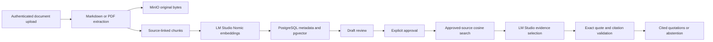

# Current implementation

Updated: 2026-09-12. The [vision](vision.md) describes future capabilities; this document describes implemented behavior.

| Component | Responsibility | Dependencies |
| --- | --- | --- |
| src/api/main.py | Bounded uploads, bearer authentication, review, approval, search, RAG, liveness | FastAPI |
| src/common/config.py | Environment selection | Python |
| src/common/storage.py | Restricted database connections and original-object persistence | psycopg / MinIO client |
| src/extraction/documents.py | Text extraction and page/source provenance | pypdf |
| src/chunking/text.py | Deterministic overlapping character windows | Extracted document records |
| src/embeddings/client.py | LM Studio requests and vector response validation | urllib; Nomic 768 dimensions |
| src/ingestion/documents.py | Idempotent transactional indexing and explicit revision approval | PostgreSQL / MinIO / embeddings |
| src/retrieval/search.py | Exact cosine search over approved revisions | pgvector / embeddings |
| src/rag/answer.py | Select and validate exact source quotations | Gemma / retrieved chunks |
| infrastructure/docker/bootstrap.py | Additive schema and restricted storage accounts | Administrative Compose access |

## Storage and lifecycle

MinIO keeps content-addressed originals in oak-sources/documents. PostgreSQL holds source revisions and chunk metadata/embeddings. Failed embedding/SQL operations do not publish partial document metadata; unindexed source objects may remain for retry. Duplicate source/content imports reuse the existing entry. Approval supersedes older approved revisions of the same source. Draft and superseded entries are excluded from retrieval.

The API uses oak_app database credentials and a MinIO user restricted to source-object reads/writes. Root storage credentials stay in the storage containers for explicit bootstrap. Data routes require FABRIC_API_KEY; /health is process liveness and remains public on loopback.

## Validation and limits

Foundation container startup/persistence and real document ingestion are validated. Retrieval and RAG passed the initial three-case live evaluation, with evidence in [STATUS](../STATUS.md). The first answer format returns exact quotations, not free-form summaries. No graph, HTTP image ingestion, OCR, generated encyclopedia, or POC execution exists yet.

Single-host HTTP and bootstrap credentials are for this local lab. Hostile PDF uploads need stronger process limits before external exposure. Embedding responses must match the configured model and 768-dimensional index. Switching models requires a separate index migration. Tags do not constitute immutable image digests.

See [ADR-005](../decisions/ADR-005-local-model-ingestion.md) and [ADR-006](../decisions/ADR-006-cited-extractive-rag.md).

## Image analyzer under milestone 3.1

The local CLI in src/ingestion/images.py preserves source bytes and writes a new review JSON draft. src/extraction/images.py validates decoded input and calls the existing LM Studio client with image bytes and an explicit schema. src/extraction/architecture.py validates component/connection/boundary references and separates inference from proposed observations. No data is published to RAG from these drafts. A synthetic vision smoke test passes; real-diagram reconstruction remains unvalidated. See [ADR-007](../decisions/ADR-007-image-observation-drafts.md).
