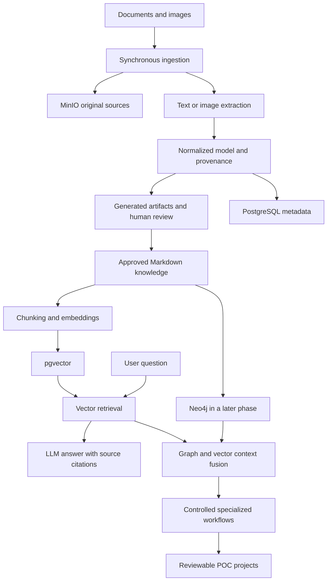

# Target architecture

This document describes the target, not a running system. Architecture knowledge is primary; AI automation follows validated storage and retrieval.

## First working slice

A source image is preserved, analyzed into a validated JSON architecture model, and rendered as reviewable Markdown and Mermaid. PostgreSQL stores metadata; pgvector stores embeddings for semantic search. A question retrieves source-linked chunks before an LLM produces a cited answer. Traditional document RAG is validated first so image-generated documents can reuse it.

## Responsibilities and dependencies

FastAPI provides bounded ingestion and query operations. Plain Python modules extract, normalize, chunk, retrieve, and render. PostgreSQL is authoritative for metadata and lifecycle state. pgvector handles similarity, while Neo4j later handles explicit relationships. MinIO preserves binary originals and raw extraction records. Markdown is canonical for approved narrative knowledge; HTML is derived separately.

A configurable local Ollama or OpenAI-compatible provider supplies embeddings, text generation, and vision when supported. Record model identifiers, embedding dimensions, and extraction versions; reject incompatible vector dimensions. No hosted account is required by the architecture. Exact packages and container versions will be selected and checked during Phase 1 implementation.

## Data and provenance

Bronze contains original bytes and raw extraction; Silver contains normalized models, chunks, entities, and relationships; Gold contains approved entries, indexes, and POC templates. Initially these are storage conventions, not Iceberg tables.

Every chunk retains chunk_id, document_id, source, source_type, title, section, page, image_reference, created_at, technology, architecture, and tags. Source checksums make re-ingestion detectable. Keep extracted facts, inferred information, researched material, and generated recommendations separate. Unknown image details remain unknown. Research requires an explicit request and its own references.

Architecture models contain source identifiers, title, components with stable IDs, relationships referencing those IDs, and evidence/uncertainty. Validate references before rendering or indexing. Preserve revisions; never overwrite approved knowledge silently.

## Review and reliability

Lifecycle: incoming → processed → generated → review → approved → knowledge-base. Generated drafts remain outside canonical search until approval. Corrections produce a new revision and trigger re-indexing; ingestion failures must not publish partial entries. Store operation status and errors so failed operations can be retried. Begin synchronously with bounded file sizes, timeouts, and explicit error responses. Cross-store writes are not atomic: record progress and make retries idempotent before adding asynchronous processing.

## Security and observability

Bind development service ports to loopback, load credentials from ignored environment files, and provide placeholder-only examples. Validate media types, file size, path traversal, and uploaded names. Treat source text as untrusted data rather than executable instructions. Use parameterized SQL/Cypher and bounded graph query operations. Generated POCs are reviewable outputs and are never automatically executed.

Initially capture structured logs with request and operation IDs, duration, and errors without source bodies or secrets. Add OpenTelemetry spans and retrieval/model/graph measurements once the core is stable, then Prometheus and Grafana. Single-machine development is not a production security or availability claim.

## Deferred capabilities

After the image/RAG slice works, introduce Neo4j, GraphRAG, controlled agents, cross-linked encyclopedia entries, and POC generation. Add Airflow, DuckDB, Iceberg, Spark, or Kafka only for a measured workload need. Airbyte, MLflow, JupyterLab, and Superset are optional future tools, not initial dependencies. Kubernetes and Helm follow stable Compose operation; Azure remains optional.

See [component map](component-map.md), [roadmap](../ROADMAP.md), and [ADRs](../decisions/ADR-001-incremental-foundation.md).
